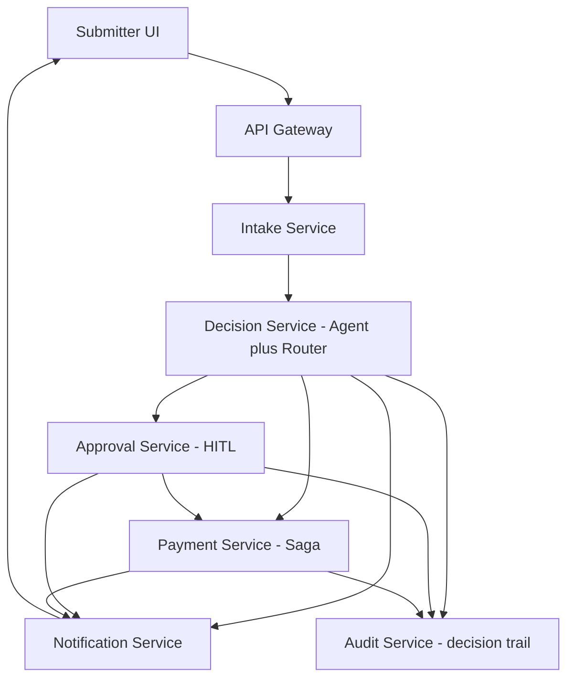
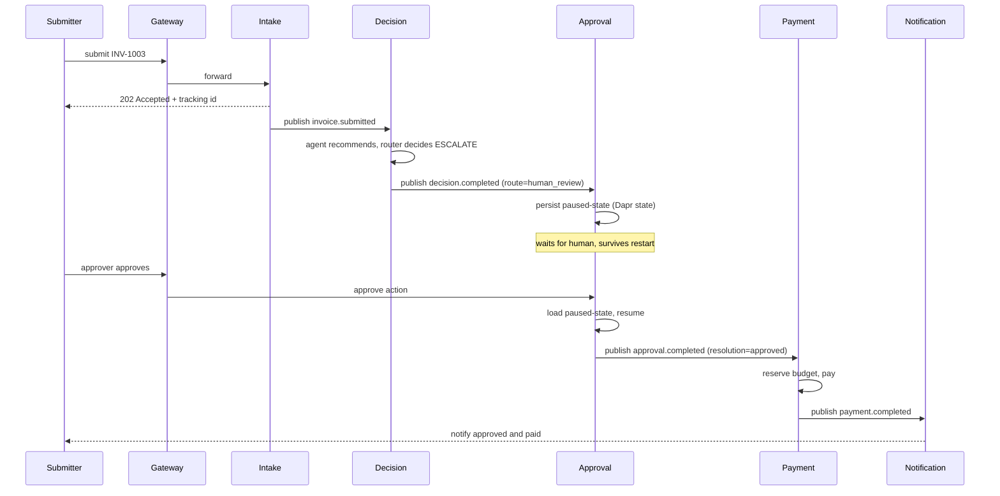
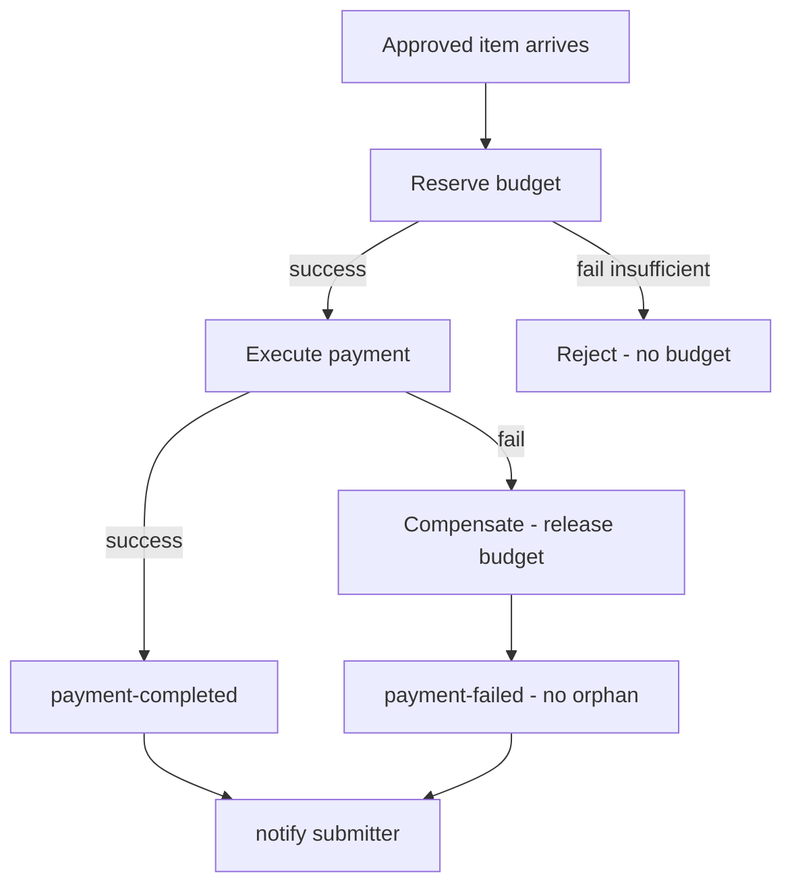

## 1. Overview
ApprovalFlow (repo: invoice-approval-workflow) is a microservice-based, AI-assisted platform that automates invoice and expense approvals. It ingests submissions, uses an AI agent to judge each against a company policy, auto-approves the low-risk majority, and escalates unclear, risky, or high-value cases to a human. Approved items run through a payment saga with budget reservation and compensation, and every decision is auditable end-to-end via a correlation id. Core principle: the AI agent only recommends; a deterministic router enforces the autonomy policy — keeping the system's safety guarantees provable.

## 2. Requirements summary
Functional: async submission with tracking id (F1), status with plain-language reason (F2), no double-pay (F3), escalation queue with agent rationale (F4), approve/reject/send-back with resume (F5), configurable policy (F7), decision trail via correlation id (F9), provable ceiling (F10).
Key non-functional: ≥3 containerized microservices (M3), one docker compose up (M4), Dapr for sync/async/state/secrets (M5), API gateway (M6), async intake (M8), saga with compensation (M9), idempotency (M10), durable HITL (M11), provable autonomy ceiling (M12), externally configurable thresholds (M13), structured logs with correlation id (M14).

## 3. System Diagram

## 4. Service Decomposition
ApprovalFlow
| Service | Single responsibility | API | Dapr block | DB |
|---|---|---|---|---|
| API Gateway | Routing, single entry point, rate limit | REST (external) | — | — |
| Intake | Accept submission, tracking id, detect duplicates | REST + pub | service invocation, pub/sub | invoices |
| Decision | Agent recommendation + deterministic router | pub/sub (async) | pub/sub, state, secrets | decisions |
| Approval | Human queue, durable pause/resume | REST + pub | state (durable), pub/sub | approvals |
| Payment | Saga: reserve budget → pay → compensate | pub/sub | pub/sub, state | payments, budgets (Dapr state/Redis - interim; see §8/§9) |
| Notification | Final result notification to submitter | pub (consumer) | pub/sub, state | notification idempotency marker (see §8) |
| Audit | Cross-service decision trail projection (F9) | REST (read) + pub (consumer) | pub/sub | audit_trail (PostgreSQL - see §8) |
| UI | Minimal interface to submit and view status; approver queue + dashboard | REST (to gateway) | — | — |

**API Gateway** - Single entry point, routes requests for services, enforce rate limiting, hide internal structure, logic free. It is the only externally supported entry point; internal service-to-service traffic remains direct over the Docker network (Dapr pub/sub) - the gateway never sits between internal services, only at the system's outer boundary. See §7 for the concrete implementation (Traefik).

**Intake** - Receives the submission, returns a tracking id immediately (F1, non-blocking), and checks for duplicates (F3) before anything else. If it's a duplicate, it short-circuits without invoking Decision - no second agent call, no second payment. Otherwise it publishes an event for processing. Its single responsibility is intake and de-duplication.

**Decision** - The heart of the system. It consumes the invoice.submitted event, loads the current policy and thresholds from Dapr configuration (M13), and runs the AI agent, which reads the invoice, cites the policy rules it applied, and emits a recommendation with a self-reported confidence score. The deterministic router then makes the binding decision by plain code - checking amount vs. ceiling, category compliance, confidence threshold, and hard stops - and routes the item to auto-approve, human review, reject, or duplicate. The agent only recommends; the router enforces, which makes the autonomy ceiling provable (M12). The LLM provider is swappable by configuration and fails cleanly on errors (M15).

**Approval** - Manages the human review queue (F4) and the durable pause/resume (M11) via Dapr state, so a paused item survives a service restart. The approver's action - approve, reject, or send-back-for-more-info - resumes the workflow. A send-back returns the item here (not to Decision), because once escalated, the human owns the decision.

**Payment** - Runs the payment as a saga (M9) to guarantee a consistent outcome across steps. It reserves the department budget, executes the payment, and on any failure runs compensating actions (release the reservation) so there are no orphaned reservations or partial/double payments. All steps are idempotent (M10), so a retried or redelivered payment produces exactly one effect. Budget management (§7) lives here because reserve and release are saga steps.

**Notification** - Listens for the final outcome and notifies the submitter (F2, M8). It's a pure consumer - it never initiates, only reacts to the result event. It is a terminal consumer in this architecture's choreography chain - it never publishes any event of its own downstream.

**Audit** - Builds the complete decision trail required by F9: a pure, observational consumer of `decision.completed`/`approval.completed`/`payment.completed`, projecting each into one row per tracking id in PostgreSQL (the `audit_trail` table), exposed for retrieval via `GET /audit/{tracking_id}`. It is a read model, not a source of truth - every business service keeps owning its own operational state; Audit only makes the cross-service history queryable in one place. It never blocks or influences a decision and publishes nothing onward; a failure of Audit cannot prevent Approval/Payment/Notification from completing (verified live - see ADR-008 and PLAN.md's Phase 9). Unlike every other service, Audit accesses PostgreSQL directly instead of through Dapr state - a deliberate, documented exception (ADR-008), since F8-style aggregation (rates, money totals) needs real SQL, not a key-value blob store.

**UI (M7)** - A minimal web interface lets a submitter send an item and track its status with a plain-language reason (F1, F2), and lets an approver act on the escalation queue (F4, F5). It also surfaces the controller dashboard (F8) showing throughput and auto-approval vs. escalation rates, read from the decision data.

## 5. IDesign Layer Mapping

The service decomposition follows IDesign's volatility-based layering rather than entity-based decomposition:

- **Managers** (orchestrate a use-case, hold flow volatility): Intake orchestrates submission, Approval orchestrates the human-in-the-loop flow, and Payment orchestrates the saga.
- **Engines** (volatile business logic): the LangGraph agent is the most volatile component (LLM, prompts, reasoning); the deterministic router holds the stable decision logic. Both are Engines at opposite ends of the volatility spectrum — which is why they live in one service but in separate modules.
- **Accessors** (isolate from data sources — DIP): Dapr's state and pub/sub building blocks decouple services from Redis; the LLM provider interface decouples the agent from any specific model (M15).
- **Resources** (the actual, most stable sources): PostgreSQL, Redis, the external LLM, and the policy configuration — all run as containers via docker-compose.

Dependencies flow strictly downward (Manager → Engine → Accessor → Resource), and services communicate sideways only through asynchronous events, never direct calls — consistent with IDesign's rules.

## 6. Technology Stack

| Category | Technology | Rationale |
|---|---|---|
| Language | Python 3.x | AI/agent ecosystem + Dapr support |
| Web framework | FastAPI | Async + auto-generated OpenAPI (D4) |
| Agent | LangGraph | Stateful agent workflow + checkpointing |
| LLM | Free-tier (Groq/Gemini) via provider interface | Swappable + fail-fast (M15); stub in CI |
| Runtime / integration | Dapr | Pub/sub, state, secrets, config (M5) |
| State + broker | Redis | Dapr state store + pub/sub backend |
| Business data | PostgreSQL | ACID for invoices, decisions, payments; also backs the Audit trail (F9, ADR-008) |
| API Gateway | Traefik | Single entry point + rate-limiting (M6) - implemented; see §7 |
| Testing | pytest | Unit + integration + e2e (M17, N6) |
| CI/CD | GitHub Actions | Quality gates on every push (M16) |
| Deployment | Docker Compose | One-command startup (M4) |

*Planned as nice-to-have if time permits (not core):* RAG over policy with a vector store (N5), full OpenTelemetry tracing with Jaeger/Prometheus/Grafana (N4), and Kubernetes manifests (B3). Service Mesh was considered but is unnecessary — Dapr already provides service invocation, mTLS, and observability hooks.

## 7. Communication

External clients use REST; internal service-to-service flow is asynchronous via Dapr pub/sub over Redis, keeping services loosely coupled. Synchronous Dapr service invocation is used only where an immediate response is required.

| Source | Destination | Protocol | Pattern | Rationale |
|---|---|---|---|---|
| UI | API Gateway | REST | Sync | Public API |
| Gateway | Intake | REST | Sync | Immediate acknowledgment (tracking id) |
| Gateway | Approval | REST | Sync | Escalation queue + approve/reject/request-info (F4/F5) |
| Gateway | Payment | REST | Sync | Payment/budget status (ops/debug, not part of the choreography) |
| Gateway | Notification | REST | Sync | Notification status (ops/debug) |
| Gateway | Audit | REST | Sync | Decision trail retrieval (F9) |
| Intake | Decision | Dapr Pub/Sub | Async | Loose coupling |
| Decision | Approval | Dapr Pub/Sub | Async | Escalation flow |
| Decision | Payment | Dapr Pub/Sub | Async | Auto-approved flow |
| Approval | Payment | Dapr Pub/Sub | Async | Resume after human decision |
| Payment | Notification | Dapr Pub/Sub | Async | Result notification |
| Decision | Notification | Dapr Pub/Sub | Async | Reject result notification |
| Intake | Notification | Dapr Pub/Sub | Async | Duplicate result notification (via `decision.completed`, see below) |
| Decision/Approval/Payment | Audit | Dapr Pub/Sub | Async | Decision trail projection (F9) - via `decision.completed`/`approval.completed`/`payment.completed`, the same three topics Notification already consumes |

Event topics: `invoice.submitted`, `decision.completed`, `approval.completed`, `payment.completed`.

`decision.completed` carries a `DecisionCompletedEvent` (invoice + `Decision`, including `route` + the agent's `Recommendation`, which may be `None` if the agent itself failed) as a single topic, not one topic per outcome - Dapr supports content-based routing (CEL match rules) for subscribers that only want a subset (e.g. Payment only wants `route == auto_approve`, Approval only wants `route == human_review`), so per-outcome filtering is a subscriber-side concern, not a publisher-side one. Decision itself never needs to know who's listening or why (choreography). The invoice and recommendation/confidence are what Approval needs to display for F4 - the bare `Decision` alone (route/reason/triggered_rules) isn't enough. `POST /decisions`'s external HTTP response is unaffected by this enrichment - it still returns the bare `Decision` only (D4, API stability); the enrichment only travels over the `decision.completed` event. `decision.completed` gets a fourth consumer this phase: Notification filters for `route in {reject, duplicate}` - closing a real, previously undocumented gap, since these two terminal outcomes had no push-notification path at all (only pull, via `GET /invoices/{id}`).

**Two publishers to `decision.completed`**: a known duplicate is short-circuited by Intake before `invoice.submitted` is ever published (running the agent for it would be pure waste - the router's own gate 1 never looks at the recommendation for a duplicate either), so Decision never sees it and never publishes an outcome for it. Discovered as a real gap during Notification's live verification: `decision.completed` simply never fired for duplicates, so Notification could never react to one. Fixed by having Intake itself publish `decision.completed` (with the same canonical `DUPLICATE` decision from `build_duplicate_decision()`) directly when it detects the short-circuit - `services/intake/decision_completed_publisher.py`, mirroring `services/decision/service/outcome_publisher.py`. This is still valid choreography, not a special case: every consumer (Payment, Notification) filters by the `route` field in the payload, never by which service published it - Payment already ignores `route != auto_approve` regardless of source, so a duplicate still never reaches payment (F3).

`approval.completed` is the same pattern, applied consistently: a single topic carrying `invoice` + `decision` + `resolution` (`approved`/`rejected`), not two separate topics per outcome. Payment filters for `resolution == approved` (see below); Notification filters for `resolution == rejected`. `request-info` (send-back to the submitter for more information) does not publish anything on this topic - per ADR-003, once escalated the human owns the decision, and there is no consumer waiting on a "still pending" signal.

`payment.completed` is the same pattern applied a third time: a single topic carrying `invoice` + `decision` + `resolution` (`completed`/`failed`) + `reason`, not two separate topics (an earlier draft of this document listed `payment.completed`/`payment.failed` separately - corrected for consistency with the two consolidations above). This reads the same way `decision.completed`/`approval.completed` already do - "the payment PROCESS completed", not "it succeeded". Notification filters by `resolution`, but acts on **both** `completed` and `failed` unconditionally (§11's flowchart already shows both the DONE and FAILED paths converging on the same NOTIFY node) - the same way Payment itself filters `decision.completed` by `route == auto_approve` and `approval.completed` by `resolution == approved`.

Notification is a pure, terminal consumer across all three subscriptions - it publishes nothing onward. Its own idempotency guard against Dapr's at-least-once redelivery (M10) is a minimal Dapr-state marker (`tracking_id` -> already-notified), not a domain record - see §8.

**Audit (F9)** subscribes to the same three topics `decision.completed`/`approval.completed`/`payment.completed` - no new event was introduced. Unlike Payment/Notification, Audit never filters by `route`/`resolution`: F9 requires the trail to be complete, including `reject`/`duplicate` outcomes. Each of the three events already carries a full `invoice` + `decision` copy, so any one of them can create the row for a given tracking id if it is the first to arrive - the design does not assume `decision.completed` is always first, even though in practice it almost always is. Later events only enrich columns the earlier one left empty ("monotonic enrichment"), never overwrite what's already there. See ADR-008 for why Audit is the one service that talks to PostgreSQL directly instead of through Dapr state.

**M6 implementation (API Gateway)**: Traefik, configured via a static file (`traefik/dynamic.yml`), matching this document's own "logic free" mandate for the gateway (§4) - it is routing + rate-limiting only, never business logic. **Not** Traefik's Docker-label provider - that was the original plan, implemented and then reverted after it proved empirically incompatible with this environment's Docker Engine version (bare `400 Bad Request` from the daemon, reproduced across two Traefik releases ~15 months apart; see ADR-007 for the full diagnosis). The file provider sidesteps this entirely: it never talks to the Docker API, so there's no Docker socket mount at all - a smaller footprint than the original plan, not just a workaround. Path-prefix routing fronts **Intake** (`/invoices`), **Approval** (`/approvals`), **Payment** (`/payments`, `/budgets`), **Notification** (`/notifications`), and **Audit** (`/audit`) - all five lose their direct host port mapping, reachable only through the gateway (port `8080`); backend addresses (`http://intake:8000`, etc.) resolve through Docker Compose's own internal DNS, which transparently re-resolves when a container is recreated (verified live). A single shared rate-limit middleware (per-client-IP, `average=10`, `burst=50`) is applied to every router, matching "the single external entry point" reading literally: there is no carve-out for endpoints that happen to be operational/debug rather than customer-facing (Payment's `GET /payments` list-all and `GET /budgets/{department}` are, if anything, more sensitive than Notification's boolean-only endpoint, not less - a reason to route them, not exempt them). **Decision gets neither a port nor a gateway route** - it is pure choreography (consumes `invoice.submitted`, publishes `decision.completed`); nothing external ever calls it over HTTP, so giving its `/decisions` testing endpoint a public route would be the opposite of "hide internal structure", not an application of it. `postgres`/`redis` keep their host ports - they are infrastructure resources (M4's "databases/queues"), not REST API surface, so they sit outside M6's scope entirely.

## 8. Data Architecture

| Data | Storage | Owner Service |
|---|---|---|
| Invoices | PostgreSQL (interim: Dapr state/Redis - see §9 Duplicate Detection) | Intake |
| Decisions | PostgreSQL | Decision |
| Approval state (paused/resume) | Redis (Dapr state) | Approval |
| Payments | Dapr state (Redis) - interim, same migration path as Invoices/Approval state above | Payment |
| Budgets | Dapr state (Redis) - interim, same as Payments; the ETag-based optimistic concurrency §9 requires (INV-1014) is a Dapr state mechanism, not a PostgreSQL one | Payment |
| Idempotency & dedup keys | Redis (Dapr state) | All services |
| Notification idempotency marker (tracking_id sent/not) | Dapr state (Redis) - point lookups/writes only, no index (nothing enumerates notified tracking_ids) | Notification |
| Audit trail (F9 - cross-service decision history, one row per tracking id) | PostgreSQL, direct `asyncpg` access (ADR-008) - no longer unused; first real consumer of this container | Audit |

Each service owns its own data (database-per-service); no service reads another's store directly - data is shared only through events.

## 9. Architectural Mechanisms

### Durable Pause/Resume (M11)
When an item is escalated (route=human_review), the Approval service persists a `PendingApproval` record (tracking id, status - pending / waiting-info / approved / rejected, the invoice data, the decision, and the agent's recommendation with confidence and cited rules for F4) to a Dapr state store (Redis) - never in the service's own memory. An append-only index (`approval:index`) tracks which tracking ids exist, since this key-value store has no query API to enumerate keys otherwise.
Because the state lives in an external store, the Approval container is stateless and disposable: if it restarts between pause and resume, it simply re-reads the pending items from the state store on the next request - nothing is lost (verified by force-recreating the approval container and its Dapr sidecar mid-flow). The status field itself is the resume point: when an approver acts, the service loads the record and validates the current status is still actionable (pending/waiting-info, not already terminal) before transitioning it - approve/reject update the status and publish `approval.completed`; send-back (`request-info`) moves status to waiting-info without publishing anything (documented gap: there is no UI/route yet for the submitter to actually supply more information and resume from there - out of scope until the Gateway/UI, M7, exists).

### Provable Autonomy Ceiling (M12)
Auto-approval is gated by a single deterministic router, which is the only code path that can return AUTO_APPROVE. The agent returns a recommendation object (recommendation, confidence, cited rules) and nothing more — it has no capability to approve. The router then applies plain, ordered checks: if amount > ceiling → human, if confidence < 0.80 → human, if any hard stop → human, if not category-compliant → human; only if all pass does it return auto-approve.
Because this is the sole path to auto-approval and the ceiling check always runs before it, the system is structurally incapable of auto-approving above the ceiling. This is proven by a test (M17) that forces the agent to recommend "approve" at confidence 1.0 on an above-ceiling invoice and asserts the outcome is human. The router consults only amounts, confidence, and hard-stop flags — never free-text — so payload steering such as "finance already approved this" (INV-1013) cannot flip the decision.

### Idempotency (M10)
Every effectful operation carries a unique idempotency key. For Payment, that key is the `tracking_id` (the same correlation id threaded end-to-end from Intake through Decision/Approval - not the invoice id, since F3's "same invoice can't be paid twice" is already guaranteed upstream by Intake's dedup check before `invoice.submitted` is even published). Before acting, the service checks whether a `PaymentRecord` already exists for that key in a terminal status (COMPLETED/FAILED); if so it skips and returns the prior result, otherwise it acts and persists the record. This guarantees exactly one effect across the three cases the spec requires: duplicate submissions (F3), redelivered events, and retried payments. Because the record store is Dapr state, it survives restarts like all other state - including a `RESERVED` (non-terminal) status, which lets a redelivered triggering event resume exactly at the charge step after a mid-saga crash, without re-reserving the budget.

### Saga & Compensation (M9)
The payment flow is a saga orchestrated by the Payment service: it runs local steps forward — reserve department budget, then execute payment — and defines a compensating action for each (release the reservation). If any step fails, the compensations run in reverse for the steps that succeeded, so the system always reaches a consistent state: either the payment completes, or every partial effect is undone. In Journey D (INV-1012), the payment step is forced to fail (a deterministic, configured simulated gateway decline - there is no real payment processor in this project); the saga compensates by releasing the reserved budget (crediting back exactly the amount that was reserved, never recomputed from the invoice), leaving no orphaned reservation and a payment-failed status. Orchestration was chosen over choreography so the flow is easy to monitor and trace.

### Externally Configurable Policy (M13)
The policy and autonomy thresholds live in a Dapr configuration store, never hard-coded. The Decision service reads them at runtime, so a controller can change the ceiling, confidence, or category limits and it takes effect immediately with no code change or redeploy (F7). The numbers in the store are the same ones enforced by the router, and must match PRODUCT-DILEMMA.md.

### Budget Concurrency (INV-1014)
Budget reservation is atomic: the Payment service uses Dapr state with optimistic concurrency (ETag). Two concurrent reservations against the same budget cannot both succeed — one wins, the other's update fails on a stale ETag and is retried or rejected as insufficient budget. This guarantees a department budget never goes below zero, even under the INV-1014A/B concurrency pair.

### Duplicate Detection (F3)
Before publishing an item for processing, the Intake service builds a deduplication key from vendor + invoiceNumber + total (GLOBAL-DUP) and checks it against Dapr state. If the key already exists, the item short-circuits to duplicate — no second agent call, no second payment (INV-1007). This is the same idempotency principle applied at the entry point.

**Implementation note - interim repository (`DaprStateInvoiceRepository`):** Intake's `InvoiceRepository` is currently backed entirely by Dapr state (Redis) - both the dedup pointer *and* the full submission record, not just the dedup key as the Data Architecture table above literally implies. This is a deliberate interim choice, not a deviation: storing only the dedup pointer in Dapr state while the full record stayed in-memory would mean the pointer could survive an Intake restart while the record it points to did not - a worse, inconsistent state than today's fully in-memory approach. Both are written together in one Dapr state transaction (atomic), and the repository migrates to `PostgresInvoiceRepository` once Approval/Payment need real persistent business data anyway (same `InvoiceRepository` Protocol, no `IntakeService` change).

**Known, accepted gap:** the dedup existence-check and the subsequent save are no longer atomic with each other now that Dapr state is real network I/O (unlike the in-memory dict's synchronous check-then-save). Two near-simultaneous submissions of the exact same invoice could both pass the check before either saves. This isn't fixable by "adding a database" in general - it's specifically that a relational store's unique constraint (atomic insert rejection) is the natural fix, and Dapr's ETag mechanism is built for update-vs-update optimistic concurrency (exactly what Budget Concurrency above needs), not "insert only if absent" on Redis. Deferred to the PostgreSQL migration above, not solved by extending Dapr state.

## 10. AI Architecture

The Decision service separates the volatile AI from the stable safety logic:

- **Agent (LangGraph + LLM):** reads the invoice, reasons against the policy, and produces a structured recommendation object — recommendation, self-reported confidence, and cited policy rules. It only recommends.
- **Deterministic router:** applies the autonomy rules (ceiling, confidence, category compliance, hard stops) in plain code. It is the only component that can issue AUTO_APPROVE.

Workflow:
1. Load policy and thresholds from Dapr config (M13).
2. Run the agent to produce a structured recommendation.
3. Apply the deterministic router.
4. Emit the final decision (auto_approve / human / reject / duplicate).

The LLM provider sits behind a swappable interface (M15) with a stub for CI. RAG over the policy (retrieving only relevant clauses instead of the full policy) is a planned nice-to-have (N5).The router can also return `reject` for high-severity policy violations (e.g. alcohol-only receipts, INV-1015) and `duplicate` for re-submissions — not every non-approval is a human escalation.

## 11. Diagrams

### Sequence - Escalate and Resume (INV-1003)

### Payment Flow with Compensation (Journey D - INV-1012)

(`payment-completed`/`payment-failed` above are diagram states, not topic names - both publish to the single `payment.completed` topic with `resolution=completed`/`failed` respectively, per §7.)

## 12. Cross-Cutting Concerns

**Logging & correlation id (M14):** every log line carries a correlation id assigned at intake, so a single request can be traced end-to-end across all services. **F9 (complete decision trail)** is implemented by the Audit service (§4/§7, ADR-008) - a dedicated, queryable PostgreSQL projection keyed by the same correlation id, not just structured logs. Before Audit existed, `recommendation` was persisted only by Approval, and only for `human_review`-routed items - for `auto_approve`/`reject`/`duplicate` (the majority), the agent's reasoning was never stored anywhere retrievable after the request completed; Audit closes that gap for every route.

**Error handling & resilience:** each service exposes a health check; the LLM provider is swappable and fails fast (never silently) on errors (M15); inter-service calls use retry and timeout - for pub/sub this is a Dapr resiliency policy on the subscriber, not application code.

**Known gap, not yet implemented (Transactional Outbox):** a service's own state write (e.g. Intake marking a submission PROCESSING) and its corresponding event publish are two separate operations, not one atomic transaction. A crash between them leaves the state written but the event never published (or vice versa). Closing this needs the Transactional Outbox pattern (write the event to the same transactional store as the state change, with a separate relay process publishing it) - deferred until a real transactional store (PostgreSQL) backs the affected repositories; `InMemoryInvoiceRepository` can't support it.

**Security:** the API gateway enforces rate-limiting (M6); secrets (LLM keys) are held in Dapr secrets, never in code. Optional JWT auth with roles - submitter / approver / admin (N1).

**Observability (planned, N4):** structured JSON logs are core; full OpenTelemetry tracing with Jaeger/Prometheus/Grafana is a nice-to-have extension.

## 13. Testing & Evaluation

| Layer | Framework | Validates |
|---|---|---|
| Unit | pytest | Router logic, policy checks, idempotency keys |
| Integration | pytest + Testcontainers | Service + Dapr + store interaction |
| End-to-end | pytest | The four journeys |
| Contract | OpenAPI (FastAPI) | API contracts (D4) |

The suite validates the four journeys (auto-approve INV-1001, escalate-resume INV-1003, duplicate INV-1007, payment compensation INV-1012) plus the guards: the autonomy-ceiling proof (M12), adversarial-prompt resistance (INV-1013), idempotency, and budget concurrency (INV-1014).

**Eval harness (planned, B1):** an automated harness over the labeled fixtures producing a metrics report - auto-approval rate, escalation rate, zero ceiling violations, zero false auto-approvals.

## 14. DevOps / CI-CD

The project follows GitHub Flow: each feature in its own branch, merged to `main` via pull request.

**CI (on every push/PR):**
| Stage | Tool |
|---|---|
| Lint | Ruff |
| Type check | MyPy |
| Unit + integration + e2e tests | pytest |
| Coverage | pytest-cov |
| Docker build | Docker |

**CD (on merge to main, planned N2):** build and publish container images automatically.

The LLM is stubbed in CI to avoid rate limits and keep runs deterministic.

## 15. Decision Records & Dilemma

Key architectural decisions are recorded as ADRs in `docs/adr/` (context → decision → consequences). The autonomy posture — the ceiling, confidence threshold, and hard stops — is stated and justified in `docs/PRODUCT-DILEMMA.md`; the thresholds there match exactly what the deterministic router enforces.
