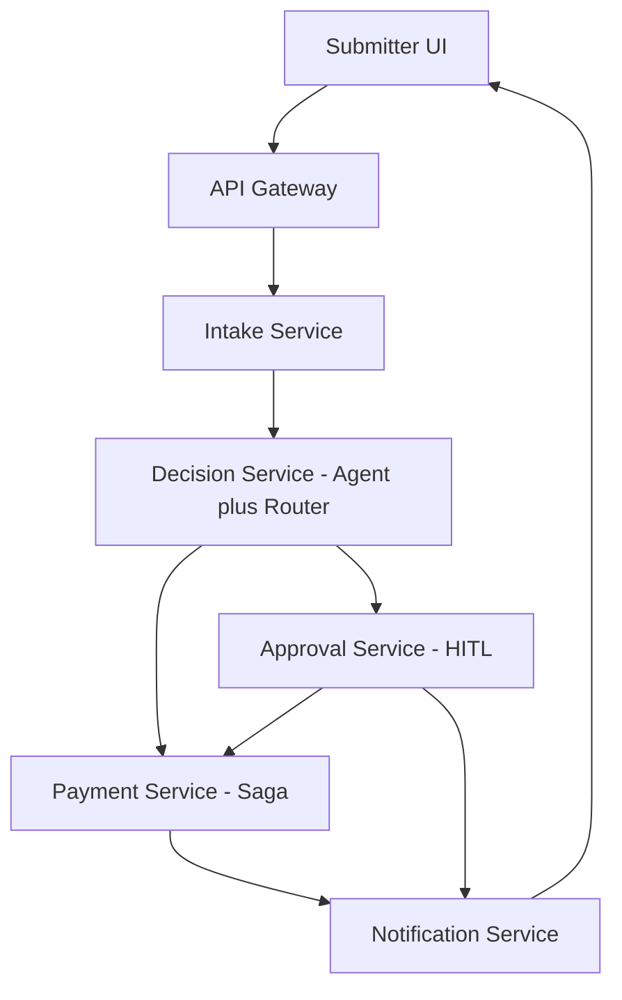
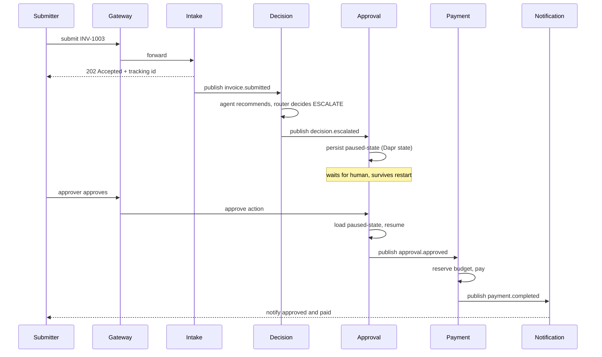
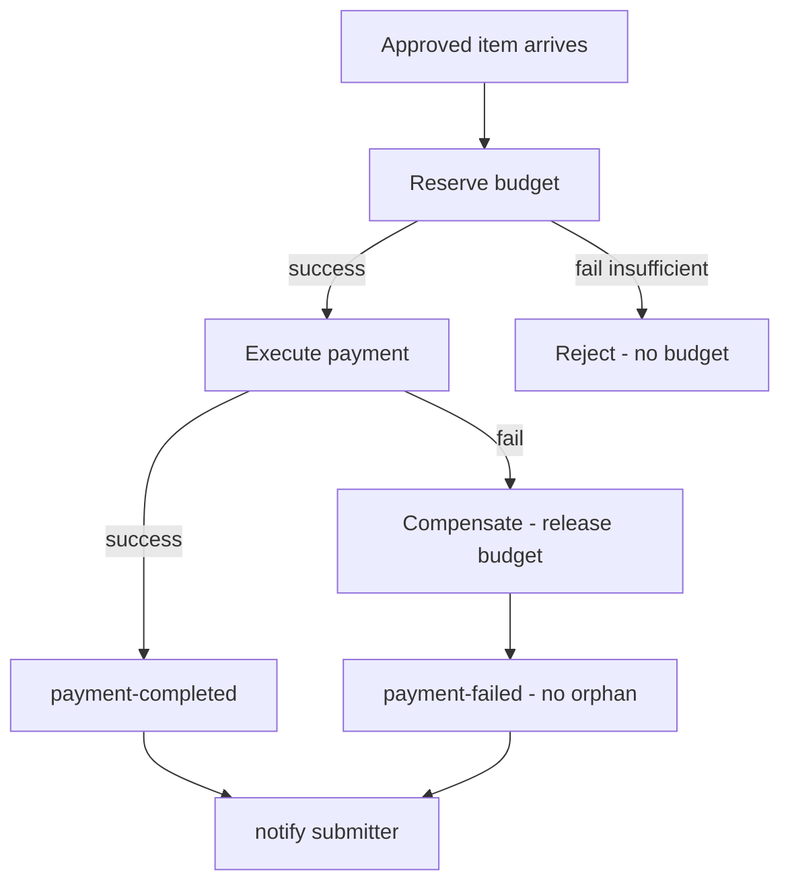

## 1. Overview
ApprovalFlow (repo: invoice-approval-workflow) is a microservice-based, AI-assisted platform that automates invoice and expense approvals. It ingests submissions, uses an AI agent to judge each against a company policy, auto-approves the low-risk majority, and escalates unclear, risky, or high-value cases to a human. Approved items run through a payment saga with budget reservation and compensation, and every decision is auditable end-to-end via a correlation id. Core principle: the AI agent only recommends; a deterministic router enforces the autonomy policy — keeping the system's safety guarantees provable.

## 2. Requirements summary
Functional: async submission with tracking id (F1), status with plain-language reason (F2), no double-pay (F3), escalation queue with agent rationale (F4), approve/reject/send-back with resume (F5), configurable policy (F7), decision trail via correlation id (F9), provable ceiling (F10).
Key non-functional: ≥3 containerized microservices (M3), one docker compose up (M4), Dapr for sync/async/state/secrets (M5), API gateway (M6), async intake (M8), saga with compensation (M9), idempotency (M10), durable HITL (M11), provable autonomy ceiling (M12), externally configurable thresholds (M13), structured logs with correlation id (M14).

## 3. System Diagram

## 4. Service Decomposition
ApprovalFlow
| Service | Single responsibility | API | Dapr block | DB |
|---|---|---|---|---|
| API Gateway | Routing, single entry point, rate limit | REST (external) | — | — |
| Intake | Accept submission, tracking id, detect duplicates | REST + pub | service invocation, pub/sub | invoices |
| Decision | Agent recommendation + deterministic router | pub/sub (async) | pub/sub, state, secrets | decisions |
| Approval | Human queue, durable pause/resume | REST + pub | state (durable), pub/sub | approvals |
| Payment | Saga: reserve budget → pay → compensate | pub/sub | pub/sub, state | payments, budgets |
| Notification | Final result notification to submitter | pub (consumer) | pub/sub | — |
| UI | Minimal interface to submit and view status; approver queue + dashboard | REST (to gateway) | — | — |

**API Gateway** - Single entry point, routes requests for services, enforce rate limiting, hide internal structure, logic free.

**Intake** - Receives the submission, returns a tracking id immediately (F1, non-blocking), and checks for duplicates (F3) before anything else. If it's a duplicate, it short-circuits without invoking Decision - no second agent call, no second payment. Otherwise it publishes an event for processing. Its single responsibility is intake and de-duplication.

**Decision** - The heart of the system. It consumes the invoice.submitted event, loads the current policy and thresholds from Dapr configuration (M13), and runs the AI agent, which reads the invoice, cites the policy rules it applied, and emits a recommendation with a self-reported confidence score. The deterministic router then makes the binding decision by plain code - checking amount vs. ceiling, category compliance, confidence threshold, and hard stops - and routes the item to auto-approve, human review, reject, or duplicate. The agent only recommends; the router enforces, which makes the autonomy ceiling provable (M12). The LLM provider is swappable by configuration and fails cleanly on errors (M15).

**Approval** - Manages the human review queue (F4) and the durable pause/resume (M11) via Dapr state, so a paused item survives a service restart. The approver's action - approve, reject, or send-back-for-more-info - resumes the workflow. A send-back returns the item here (not to Decision), because once escalated, the human owns the decision.

**Payment** - Runs the payment as a saga (M9) to guarantee a consistent outcome across steps. It reserves the department budget, executes the payment, and on any failure runs compensating actions (release the reservation) so there are no orphaned reservations or partial/double payments. All steps are idempotent (M10), so a retried or redelivered payment produces exactly one effect. Budget management (§7) lives here because reserve and release are saga steps.

**Notification** - Listens for the final outcome and notifies the submitter (F2, M8). It's a pure consumer - it never initiates, only reacts to the result event.

**UI (M7)** - A minimal web interface lets a submitter send an item and track its status with a plain-language reason (F1, F2), and lets an approver act on the escalation queue (F4, F5). It also surfaces the controller dashboard (F8) showing throughput and auto-approval vs. escalation rates, read from the decision data.

## 5. IDesign Layer Mapping

The service decomposition follows IDesign's volatility-based layering rather than entity-based decomposition:

- **Managers** (orchestrate a use-case, hold flow volatility): Intake orchestrates submission, Approval orchestrates the human-in-the-loop flow, and Payment orchestrates the saga.
- **Engines** (volatile business logic): the LangGraph agent is the most volatile component (LLM, prompts, reasoning); the deterministic router holds the stable decision logic. Both are Engines at opposite ends of the volatility spectrum — which is why they live in one service but in separate modules.
- **Accessors** (isolate from data sources — DIP): Dapr's state and pub/sub building blocks decouple services from Redis; the LLM provider interface decouples the agent from any specific model (M15).
- **Resources** (the actual, most stable sources): PostgreSQL, Redis, the external LLM, and the policy configuration — all run as containers via docker-compose.

Dependencies flow strictly downward (Manager → Engine → Accessor → Resource), and services communicate sideways only through asynchronous events, never direct calls — consistent with IDesign's rules.

## 6. Technology Stack

| Category | Technology | Rationale |
|---|---|---|
| Language | Python 3.x | AI/agent ecosystem + Dapr support |
| Web framework | FastAPI | Async + auto-generated OpenAPI (D4) |
| Agent | LangGraph | Stateful agent workflow + checkpointing |
| LLM | Free-tier (Groq/Gemini) via provider interface | Swappable + fail-fast (M15); stub in CI |
| Runtime / integration | Dapr | Pub/sub, state, secrets, config (M5) |
| State + broker | Redis | Dapr state store + pub/sub backend |
| Business data | PostgreSQL | ACID for invoices, decisions, payments |
| API Gateway | Traefik / NGINX | Single entry point + rate-limiting (M6) |
| Testing | pytest | Unit + integration + e2e (M17, N6) |
| CI/CD | GitHub Actions | Quality gates on every push (M16) |
| Deployment | Docker Compose | One-command startup (M4) |

*Planned as nice-to-have if time permits (not core):* RAG over policy with a vector store (N5), full OpenTelemetry tracing with Jaeger/Prometheus/Grafana (N4), and Kubernetes manifests (B3). Service Mesh was considered but is unnecessary — Dapr already provides service invocation, mTLS, and observability hooks.

## 7. Communication

External clients use REST; internal service-to-service flow is asynchronous via Dapr pub/sub over Redis, keeping services loosely coupled. Synchronous Dapr service invocation is used only where an immediate response is required.

| Source | Destination | Protocol | Pattern | Rationale |
|---|---|---|---|---|
| UI | API Gateway | REST | Sync | Public API |
| Gateway | Intake | REST | Sync | Immediate acknowledgment (tracking id) |
| Intake | Decision | Dapr Pub/Sub | Async | Loose coupling |
| Decision | Approval | Dapr Pub/Sub | Async | Escalation flow |
| Decision | Payment | Dapr Pub/Sub | Async | Auto-approved flow |
| Approval | Payment | Dapr Pub/Sub | Async | Resume after human decision |
| Payment | Notification | Dapr Pub/Sub | Async | Result notification |

Event topics: `invoice.submitted`, `decision.approved`, `decision.escalated`, `approval.approved`, `approval.rejected`, `payment.completed`, `payment.failed`.

## 8. Data Architecture

| Data | Storage | Owner Service |
|---|---|---|
| Invoices | PostgreSQL | Intake |
| Decisions | PostgreSQL | Decision |
| Approval state (paused/resume) | Redis (Dapr state) | Approval |
| Payments | PostgreSQL | Payment |
| Budgets | PostgreSQL | Payment |
| Idempotency & dedup keys | Redis (Dapr state) | All services |

Each service owns its own data (database-per-service); no service reads another's store directly - data is shared only through events.

## 9. Architectural Mechanisms

### Durable Pause/Resume (M11)
When an item is escalated, the Approval service persists a paused-state record to a Dapr state store (Redis or PostgreSQL running as a separate container with a volume) - never in the service's own memory. The record holds the tracking id, status (pending / waiting-info), the invoice data, the agent's recommendation, confidence and cited rules (F4), and a resume point marking where the flow paused.
Because the state lives in an external store, the Approval container is stateless and disposable: if it restarts between pause and resume, it simply re-reads the pending items from the state store - nothing is lost. When an approver acts, the service loads the record, reads the resume point, and continues from exactly there: approve → Payment, reject → Notification, send-back → status becomes waiting-info and the submitter is asked for more.

### Provable Autonomy Ceiling (M12)
Auto-approval is gated by a single deterministic router, which is the only code path that can return AUTO_APPROVE. The agent returns a recommendation object (recommendation, confidence, cited rules) and nothing more — it has no capability to approve. The router then applies plain, ordered checks: if amount > ceiling → human, if confidence < 0.80 → human, if any hard stop → human, if not category-compliant → human; only if all pass does it return auto-approve.
Because this is the sole path to auto-approval and the ceiling check always runs before it, the system is structurally incapable of auto-approving above the ceiling. This is proven by a test (M17) that forces the agent to recommend "approve" at confidence 1.0 on an above-ceiling invoice and asserts the outcome is human. The router consults only amounts, confidence, and hard-stop flags — never free-text — so payload steering such as "finance already approved this" (INV-1013) cannot flip the decision.

### Idempotency (M10)
Every effectful operation carries a unique idempotency key (e.g. pay:INV-1012). Before acting, the service checks whether that key was already processed (stored in Dapr state); if so it skips and returns the prior result, otherwise it acts and records the key. This guarantees exactly one effect across the three cases the spec requires: duplicate submissions (F3), redelivered events, and retried payments. Because the key store is Dapr state, it survives restarts like all other state.

### Saga & Compensation (M9)
The payment flow is a saga orchestrated by the Payment service: it runs local steps forward — reserve department budget, then execute payment — and defines a compensating action for each (release the reservation). If any step fails, the compensations run in reverse for the steps that succeeded, so the system always reaches a consistent state: either the payment completes, or every partial effect is undone. In Journey D (INV-1012), the payment step is forced to fail; the saga compensates by releasing the reserved budget, leaving no orphaned reservation and a payment-failed status. Orchestration was chosen over choreography so the flow is easy to monitor and trace.

### Externally Configurable Policy (M13)
The policy and autonomy thresholds live in a Dapr configuration store, never hard-coded. The Decision service reads them at runtime, so a controller can change the ceiling, confidence, or category limits and it takes effect immediately with no code change or redeploy (F7). The numbers in the store are the same ones enforced by the router, and must match PRODUCT-DILEMMA.md.

### Budget Concurrency (INV-1014)
Budget reservation is atomic: the Payment service uses Dapr state with optimistic concurrency (ETag). Two concurrent reservations against the same budget cannot both succeed — one wins, the other's update fails on a stale ETag and is retried or rejected as insufficient budget. This guarantees a department budget never goes below zero, even under the INV-1014A/B concurrency pair.

### Duplicate Detection (F3)
Before publishing an item for processing, the Intake service builds a deduplication key from vendor + invoiceNumber + total (GLOBAL-DUP) and checks it against Dapr state. If the key already exists, the item short-circuits to duplicate — no second agent call, no second payment (INV-1007). This is the same idempotency principle applied at the entry point.

## 10. AI Architecture

The Decision service separates the volatile AI from the stable safety logic:

- **Agent (LangGraph + LLM):** reads the invoice, reasons against the policy, and produces a structured recommendation object — recommendation, self-reported confidence, and cited policy rules. It only recommends.
- **Deterministic router:** applies the autonomy rules (ceiling, confidence, category compliance, hard stops) in plain code. It is the only component that can issue AUTO_APPROVE.

Workflow:
1. Load policy and thresholds from Dapr config (M13).
2. Run the agent to produce a structured recommendation.
3. Apply the deterministic router.
4. Emit the final decision (auto_approve / human / reject / duplicate).

The LLM provider sits behind a swappable interface (M15) with a stub for CI. RAG over the policy (retrieving only relevant clauses instead of the full policy) is a planned nice-to-have (N5).The router can also return `reject` for high-severity policy violations (e.g. alcohol-only receipts, INV-1015) and `duplicate` for re-submissions — not every non-approval is a human escalation.

## 11. Diagrams

### Sequence - Escalate and Resume (INV-1003)

### Payment Flow with Compensation (Journey D - INV-1012)

## 12. Cross-Cutting Concerns

**Logging & correlation id (M14):** every log line carries a correlation id assigned at intake, so a single request can be traced end-to-end across all services - this is also the backbone of the auditor's decision trail (F9).

**Error handling & resilience:** each service exposes a health check; the LLM provider is swappable and fails fast (never silently) on errors (M15); inter-service calls use retry and timeout.

**Security:** the API gateway enforces rate-limiting (M6); secrets (LLM keys) are held in Dapr secrets, never in code. Optional JWT auth with roles - submitter / approver / admin (N1).

**Observability (planned, N4):** structured JSON logs are core; full OpenTelemetry tracing with Jaeger/Prometheus/Grafana is a nice-to-have extension.

## 13. Testing & Evaluation

| Layer | Framework | Validates |
|---|---|---|
| Unit | pytest | Router logic, policy checks, idempotency keys |
| Integration | pytest + Testcontainers | Service + Dapr + store interaction |
| End-to-end | pytest | The four journeys |
| Contract | OpenAPI (FastAPI) | API contracts (D4) |

The suite validates the four journeys (auto-approve INV-1001, escalate-resume INV-1003, duplicate INV-1007, payment compensation INV-1012) plus the guards: the autonomy-ceiling proof (M12), adversarial-prompt resistance (INV-1013), idempotency, and budget concurrency (INV-1014).

**Eval harness (planned, B1):** an automated harness over the labeled fixtures producing a metrics report - auto-approval rate, escalation rate, zero ceiling violations, zero false auto-approvals.

## 14. DevOps / CI-CD

The project follows GitHub Flow: each feature in its own branch, merged to `main` via pull request.

**CI (on every push/PR):**
| Stage | Tool |
|---|---|
| Lint | Ruff |
| Type check | MyPy |
| Unit + integration + e2e tests | pytest |
| Coverage | pytest-cov |
| Docker build | Docker |

**CD (on merge to main, planned N2):** build and publish container images automatically.

The LLM is stubbed in CI to avoid rate limits and keep runs deterministic.

## 15. Decision Records & Dilemma

Key architectural decisions are recorded as ADRs in `docs/adr/` (context → decision → consequences). The autonomy posture — the ceiling, confidence threshold, and hard stops — is stated and justified in `docs/PRODUCT-DILEMMA.md`; the thresholds there match exactly what the deterministic router enforces.
